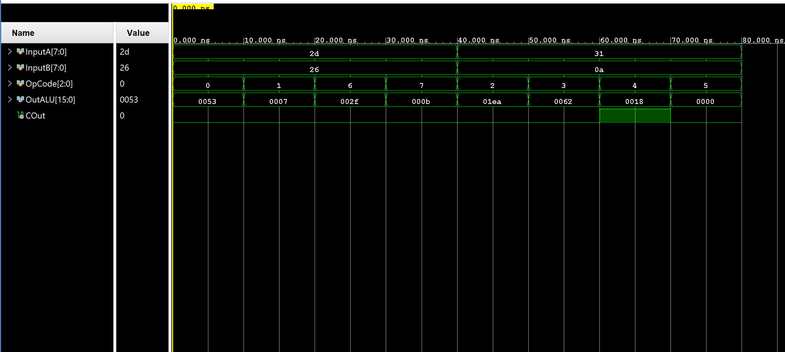
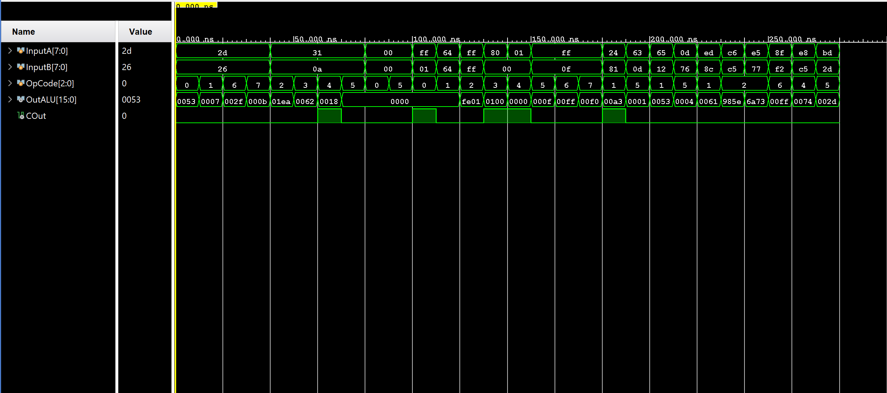
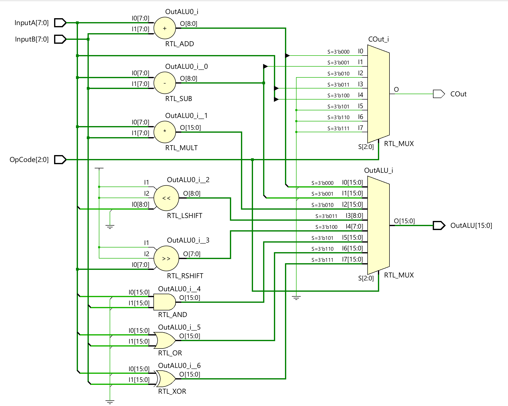
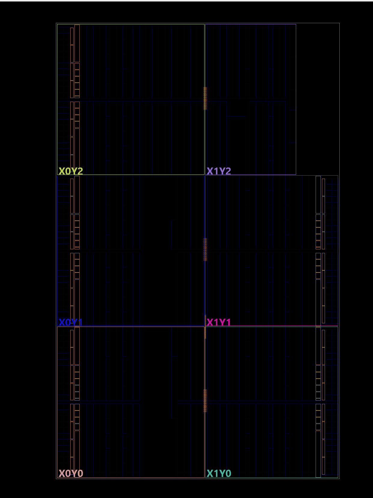
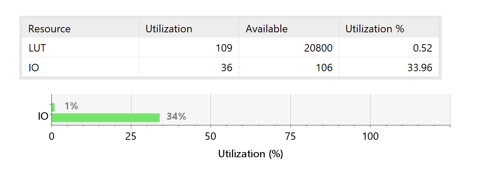
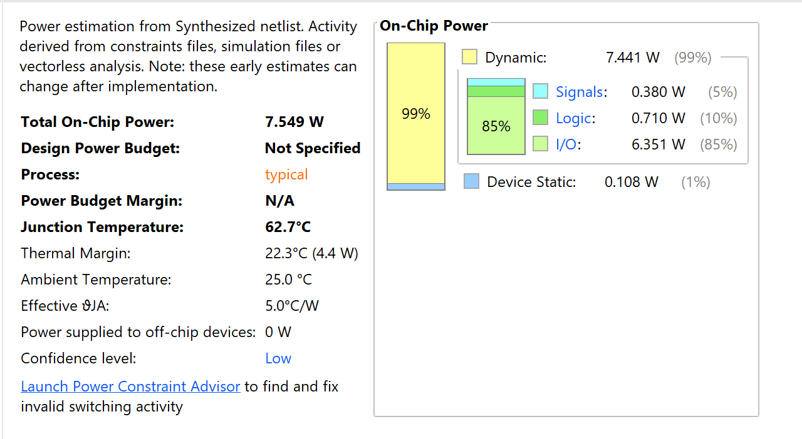

# 8-Bit Arithmetic Logic Unit (ALU) with AI-Assisted Verification


## Overview

This project presents the design, simulation, synthesis, and verification of an 8-bit Arithmetic Logic Unit (ALU) using Verilog HDL and AMD Vivado Design Suite.

A major objective of this work was to explore the use of Artificial Intelligence in digital verification workflows by generating an initial testbench using AI tools and subsequently refining it through manual engineering analysis and prompt improvement.

---

## Features

- Synthesizable Verilog RTL implementation
- Support for 8 arithmetic and logical operations
- AI-generated verification environment
- Improved manually refined testbench
- Functional simulation using AMD Vivado
- RTL synthesis and FPGA resource analysis
- Power estimation and device utilization study
- GitHub-based project documentation

---

## Supported Operations

| Opcode | Operation |
|--------|-----------|
| 000 | Addition |
| 001 | Subtraction |
| 010 | Multiplication |
| 011 | Left Shift |
| 100 | Right Shift |
| 101 | Bitwise AND |
| 110 | Bitwise OR |
| 111 | Bitwise XOR |

---

## Project Structure

```text
8-bit-alu-ai-verification/
│
├── RTL/
├── Testbench/
├── Images/
├── Reports/
├── Docs/
├── LICENSE
└── README.md
```

---

## Verification Strategy

The project followed a three-stage verification methodology:

1. AI-generated testbench generation.
2. Prompt refinement and additional edge-case coverage.
3. Final validated verification environment.

Additional verification cases included:

- Zero inputs
- Maximum values (255)
- Addition overflow
- Subtraction resulting in zero
- Shift boundary conditions
- Multiplication overflow
- Random test vectors

---

## Synthesis Results

| Resource | Utilization | Available | Utilization % |
|----------|-------------|-----------|---------------|
| LUT | 109 | 20800 | 0.52% |
| IO | 36 | 106 | 33.96% |

---

## Power Analysis

| Parameter | Value |
|-----------|-------|
| Total On-Chip Power | 7.549 W |
| Dynamic Power | 7.441 W |
| Static Power | 0.108 W |
| Junction Temperature | 62.7 °C |

---

## Results

### Simulation Waveform




### RTL Schematic




### FPGA Device View



### Resource Utilization



### Power Analysis




## Tools Used

- Verilog HDL
- AMD Vivado Design Suite 2025.2
- GitHub
- ChatGPT

---

## Repository Contents

- RTL source code
- Original AI-generated testbench
- Improved verification testbench
- Simulation waveforms
- Synthesis reports
- Power analysis reports
- Final project report
- Assignment documentation

---

## Future Improvements

- Parameterized ALU width
- Signed arithmetic support
- Additional arithmetic operations
- FPGA hardware implementation
- SystemVerilog constrained-random verification

---

## Author

**Shivam Chaurasiya**

B.Tech Electronics and Communication Engineering (ECE)

Interested in VLSI Design, Semiconductor Devices, Digital Design, and Verification.

---
